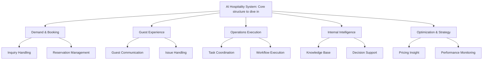

# AMD_Hackathon_2026
Track 1: AI Agents &amp; Agentic Workflows

draw.io: https://drive.google.com/file/d/1PiAbIwgNhu8kGpRV5jepAT9Es3hDt3En/view?usp=sharing

Core structure to dive in:



## AI Hospitality Optimization & Strategy

This repository includes a Python 3.10 sample module for the
**Optimization & Strategy** branch of the AI Hospitality System:

- Pricing Insight
- Performance Monitoring

The implementation uses a clean architecture style so the local
`MockCrawlerClient` can later be replaced by a real MCP crawler adapter without
changing the business services.

## Architecture

```text
src/hospitality_ai/
  config/          Environment-based settings.
  domain/          Dataclasses, enums, and domain exceptions.
  application/     Service layer and dependency inversion interfaces.
  infrastructure/  Mock MCP crawler, future MCP adapter, repository, LLM client.
  agents/          CrewAI/LangChain orchestration facades.
  interfaces/      CLI and optional API composition.
tests/             Unit tests for application services.
```

Dependency direction:

```text
interfaces -> agents -> application -> domain
infrastructure -> application interfaces + domain
```

Agents only orchestrate service calls. Pricing comparison, recommendation
rules, monitoring metrics, and alert generation live in the application service
layer.

## Local Setup

```bash
python3.10 -m venv .venv
source .venv/bin/activate
pip install -e ".[dev]"
```

Copy `.env.example` to `.env` if you want to override defaults. The first
version runs with mock MCP data and deterministic mock summaries, so no external
LLM or OTA API key is required.

## Use A Real LLM

By default, summaries use `MockLLMClient`. To call a real OpenAI-compatible
chat completion API, set:

```bash
HOSPITALITY_USE_REAL_LLM=true
HOSPITALITY_LLM_MODEL=gpt-4o-mini
HOSPITALITY_LLM_BASE_URL=https://api.openai.com/v1
HOSPITALITY_LLM_API_KEY=<your_api_key>
```

Then run any workflow:

```bash
PYTHONPATH=src python3 -m hospitality_ai.interfaces.cli pricing-insight
PYTHONPATH=src python3 -m hospitality_ai.interfaces.cli performance-monitoring
```

For local or AMD/OpenAI-compatible gateways, change `HOSPITALITY_LLM_BASE_URL`
to that provider's `/v1` endpoint and set the matching model name.

## Run The Demo CLI

```bash
python -m hospitality_ai.interfaces.cli pricing-insight
python -m hospitality_ai.interfaces.cli performance-monitoring
python -m hospitality_ai.interfaces.cli trip-price
```

## Run Local Services Together

Use this when you want `ota-crawl` and `hospitality_ai` running at the same
time:

```bash
python scripts/run_local_services.py
```

Prerequisites:

```bash
pip install -e ".[api]"
pip install -r ota-crawl/requirements.txt
```

Defaults:

- `ota-crawl`: `http://localhost:8000`
- `hospitality_ai`: `http://localhost:8100`
- `hospitality_ai` calls Trip Price API through
  `HOSPITALITY_TRIP_PRICE_API_BASE_URL=http://localhost:8000`
- Own hotel ID defaults to `119242771`
- Trip URLs default to:
  - `kin-hotel-dong-du`
  - `silverland-jolie-ho-chi-minh-city`
  - `icon-saigon-luxury-design-hotel`
  - `bong-sen-hotel-saigon`
- Check-in defaults to the day the script starts, check-out is the next day.

Trigger pricing insight:

```bash
curl http://localhost:8100/pricing-insight
```

Alias:

```bash
curl http://localhost:8100/price-insight
```

The response includes:

- `pricing_records`: normalized Trip `PricingRecord` rows from own hotel and
  competitors.
- `insights`: computed current price, competitor average, price gap, and
  recommendation. When competitor room names differ, the LLM selects
  comparable competitor `record_id` values first; the service then computes
  the benchmark from those selected records instead of averaging every
  competitor room on the same date.
- `recommended_price`: target price that closes part of the gap to the
  comparable benchmark.
- `summary`: LLM or mock-LLM business recommendation context.

Override ports if needed:

```bash
OTA_CRAWL_PORT=8001 \
HOSPITALITY_API_PORT=8101 \
python scripts/run_local_services.py
```

If your `ota-crawl` module needs a custom start command:

```bash
OTA_CRAWL_COMMAND='python path/to/ota-crawl/main.py' \
python scripts/run_local_services.py
```

Text output is also available:

```bash
python -m hospitality_ai.interfaces.cli pricing-insight --format text
python -m hospitality_ai.interfaces.cli performance-monitoring --format text
python -m hospitality_ai.interfaces.cli trip-price --format text
```

## Trip Price API / MCP Integration

The project includes a small embedded Trip.com price API based on the
`ota-crawl` response contract:

- The FastAPI app exposes `POST /v1/prices/collect/trip`.
- `TripOtaPriceApiClient` can call that endpoint over HTTP.
- `TripPriceService` processes the OTA response and normalizes records into
  `PricingRecord`.
- `TripMcpCrawlerClient` exposes the processed Trip data through the same
  crawler contract used by Pricing Insight and Performance Monitoring.
- `trip_price_server.py` exposes MCP tools when the optional `mcp` package is
  installed.

Run the local mock Trip Price API processing demo:

```bash
python -m hospitality_ai.interfaces.cli trip-price
```

Run the embedded FastAPI app:

```bash
pip install -e ".[api]"
PYTHONPATH=src uvicorn "hospitality_ai.interfaces.api:create_app" \
  --factory \
  --host 0.0.0.0 \
  --port 8000
```

Call the embedded Trip endpoint:

```bash
curl -X POST http://localhost:8000/v1/prices/collect/trip \
  -H "Content-Type: application/json" \
  -d '{
    "hotel_urls": [
      "https://www.trip.com/hotels/detail?hotelId=hotel_own",
      "https://www.trip.com/hotels/detail?hotelId=hotel_comp_a"
    ],
    "check_in_date": "2026-06-01",
    "check_out_date": "2026-06-02",
    "adults": 2,
    "rooms": 1,
    "currency": "VND"
  }'
```

Use processed Trip data as the crawler source for existing workflows:

```bash
HOSPITALITY_CRAWLER_SOURCE=trip-api \
HOSPITALITY_TRIP_PRICE_API_MODE=mock \
python -m hospitality_ai.interfaces.cli pricing-insight
```

To call a local `ota-crawl` service through the HTTP adapter and transform its
raw Trip response into compact LLM-ready data:

```bash
HOSPITALITY_TRIP_PRICE_API_MODE=http \
HOSPITALITY_TRIP_PRICE_API_BASE_URL=http://localhost:8000 \
HOSPITALITY_OWN_HOTEL_ID=<trip_property_id> \
HOSPITALITY_TRIP_HOTEL_URLS=<trip_url> \
HOSPITALITY_TRIP_CHECK_IN_DATES=2026-05-15 \
HOSPITALITY_TRIP_CHECK_OUT_DATE=2026-05-16 \
python -m hospitality_ai.interfaces.cli trip-price
```

To use that transformed Trip data inside Pricing Insight:

```bash
HOSPITALITY_CRAWLER_SOURCE=trip-api \
HOSPITALITY_TRIP_PRICE_API_MODE=http \
HOSPITALITY_TRIP_PRICE_API_BASE_URL=http://localhost:8000 \
HOSPITALITY_OWN_HOTEL_ID=<trip_property_id> \
HOSPITALITY_TRIP_HOTEL_URLS=<own_trip_url>,<competitor_trip_url> \
python -m hospitality_ai.interfaces.cli pricing-insight
```

Run the Trip MCP server after installing the MCP extra:

```bash
pip install -e ".[mcp]"
hospitality-trip-mcp
```

Available MCP tools:

- `collect_trip_prices`: returns the full processed collection object.
- `collect_trip_pricing_records`: returns normalized pricing records only.

## Run Tests

```bash
pytest
```

## How To Replace Mock MCP With Real MCP

The application services depend on the `CrawlerClient` protocol in
`src/hospitality_ai/application/interfaces.py`.

To connect a real MCP crawler:

1. Implement `fetch_pricing_records()` and `fetch_crawler_runs()` in
   `src/hospitality_ai/infrastructure/mcp/crawler_client.py`.
2. Return raw pricing payloads with these fields:
   `hotel_id`, `hotel_name`, `platform`, `room_type`, `check_in_date`, `price`,
   `tax`, `discount`, `crawled_at`.
3. Return crawler telemetry as `CrawlerRunMetric`.
4. Swap `MockCrawlerClient` for `McpCrawlerClient` in the composition root,
   currently `src/hospitality_ai/interfaces/cli.py`.

No pricing or monitoring business logic should be added to the MCP adapter or
agent layer.
