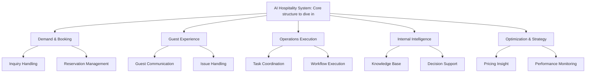

# AMD_Hackathon_2026
Track 1: AI Agents &amp; Agentic Workflows

draw.io: https://drive.google.com/file/d/1PiAbIwgNhu8kGpRV5jepAT9Es3hDt3En/view?usp=sharing

Core structure to dive in:

```mermaid
graph TD
    A[AI Hospitality System: Core structure to dive in]

    A --> B[Demand & Booking]
    A --> C[Guest Experience]
    A --> D[Operations Execution]
    A --> E[Internal Intelligence]
    A --> F[Optimization & Strategy]

    B --> B1[Inquiry Handling]
    B --> B2[Reservation Management]

    C --> C1[Guest Communication]
    C --> C2[Issue Handling]

    D --> D1[Task Coordination]
    D --> D2[Workflow Execution]

    E --> E1[Knowledge Base]
    E --> E2[Decision Support]

    F --> F1[Pricing Insight]
    F --> F2[Performance Monitoring]

    
```
