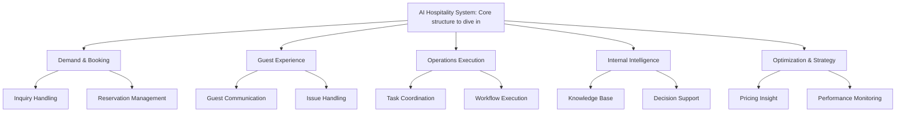

# AMD_Hackathon_2026
Track 1: AI Agents &amp; Agentic Workflows

draw.io: https://drive.google.com/file/d/1PiAbIwgNhu8kGpRV5jepAT9Es3hDt3En/view?usp=sharing

Core structure to dive in:



## AI Hospitality Optimization & Strategy

This repository includes a Python 3.10 sample module for the
**Optimization & Strategy** branch of the AI Hospitality System:

- Pricing Insight
- Performance Monitoring

The implementation uses a clean architecture style so the local
`MockCrawlerClient` can later be replaced by a real MCP crawler adapter without
changing the business services.

## Architecture

```text
src/hospitality_ai/
  config/          Environment-based settings.
  domain/          Dataclasses, enums, and domain exceptions.
  application/     Service layer and dependency inversion interfaces.
  infrastructure/  Mock MCP crawler, future MCP adapter, repository, LLM client.
  agents/          CrewAI/LangChain orchestration facades.
  interfaces/      CLI and optional API composition.
tests/             Unit tests for application services.
```

Dependency direction:

```text
interfaces -> agents -> application -> domain
infrastructure -> application interfaces + domain
```

Agents only orchestrate service calls. Pricing comparison, recommendation
rules, monitoring metrics, and alert generation live in the application service
layer.

## Local Setup

```bash
python3.10 -m venv .venv
source .venv/bin/activate
pip install -e ".[dev]"
```

Copy `.env.example` to `.env` if you want to override defaults. The first
version runs with mock MCP data and deterministic mock summaries, so no external
LLM or OTA API key is required.

## Run The Demo CLI

```bash
python -m hospitality_ai.interfaces.cli pricing-insight
python -m hospitality_ai.interfaces.cli performance-monitoring
```

Text output is also available:

```bash
python -m hospitality_ai.interfaces.cli pricing-insight --format text
python -m hospitality_ai.interfaces.cli performance-monitoring --format text
```

## Run Tests

```bash
pytest
```

## How To Replace Mock MCP With Real MCP

The application services depend on the `CrawlerClient` protocol in
`src/hospitality_ai/application/interfaces.py`.

To connect a real MCP crawler:

1. Implement `fetch_pricing_records()` and `fetch_crawler_runs()` in
   `src/hospitality_ai/infrastructure/mcp/crawler_client.py`.
2. Return raw pricing payloads with these fields:
   `hotel_id`, `hotel_name`, `platform`, `room_type`, `check_in_date`, `price`,
   `tax`, `discount`, `crawled_at`.
3. Return crawler telemetry as `CrawlerRunMetric`.
4. Swap `MockCrawlerClient` for `McpCrawlerClient` in the composition root,
   currently `src/hospitality_ai/interfaces/cli.py`.

No pricing or monitoring business logic should be added to the MCP adapter or
agent layer.
