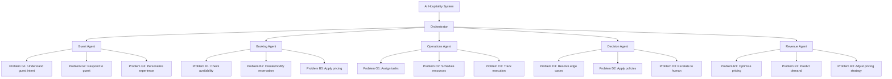

Core structure to dive in:

```mermaid
graph TD
    A[AI Hospitality System]

    A --> G[Orchestrator]

    G --> GA[Guest Agent]
    G --> BA[Booking Agent]
    G --> OA[Operations Agent]
    G --> DA[Decision Agent]
    G --> RA[Revenue Agent]

    %% Guest Agent Problems
    GA --> GA1[Problem G1: Understand guest intent]
    GA --> GA2[Problem G2: Respond to guest]
    GA --> GA3[Problem G3: Personalize experience]

    %% Booking Agent Problems
    BA --> BA1[Problem B1: Check availability]
    BA --> BA2[Problem B2: Create/modify reservation]
    BA --> BA3[Problem B3: Apply pricing]

    %% Operations Agent Problems
    OA --> OA1[Problem O1: Assign tasks]
    OA --> OA2[Problem O2: Schedule resources]
    OA --> OA3[Problem O3: Track execution]

    %% Decision Agent Problems
    DA --> DA1[Problem D1: Resolve edge cases]
    DA --> DA2[Problem D2: Apply policies]
    DA --> DA3[Problem D3: Escalate to human]

    %% Revenue Agent Problems
    RA --> RA1[Problem R1: Optimize pricing]
    RA --> RA2[Problem R2: Predict demand]
    RA --> RA3[Problem R3: Adjust pricing strategy]
```